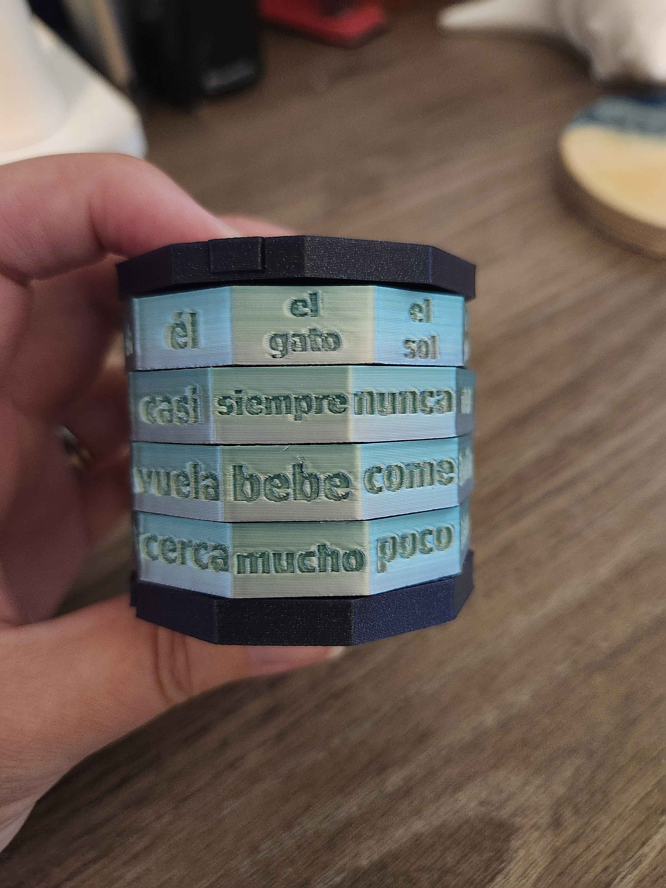
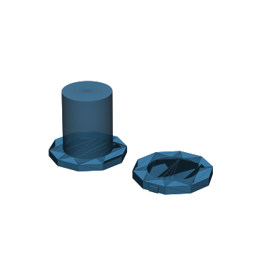
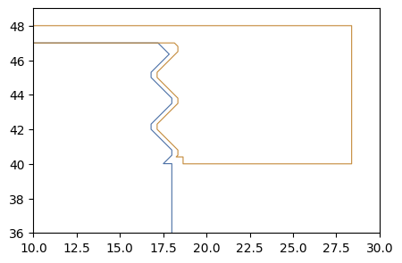
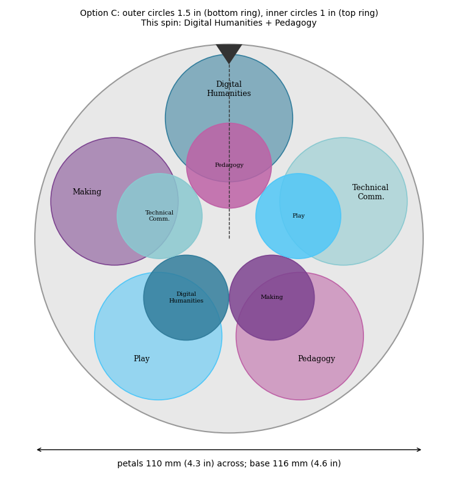
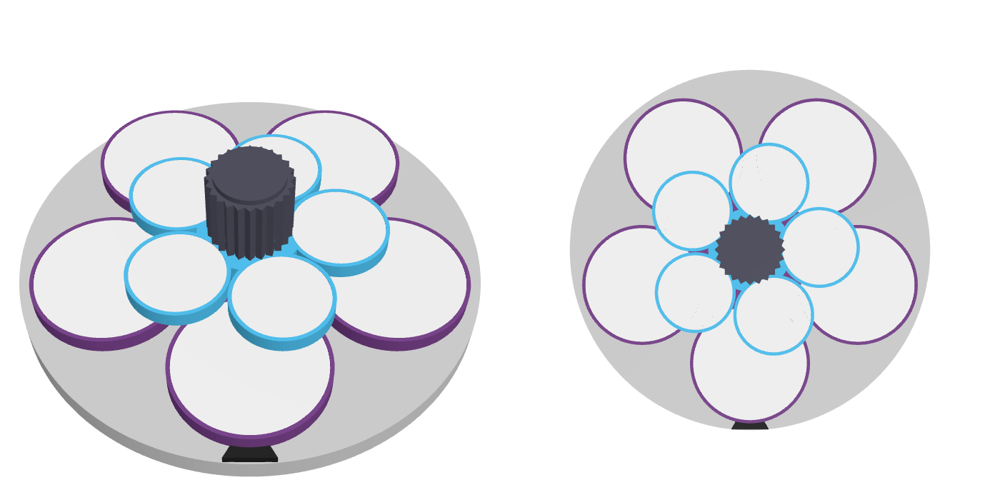
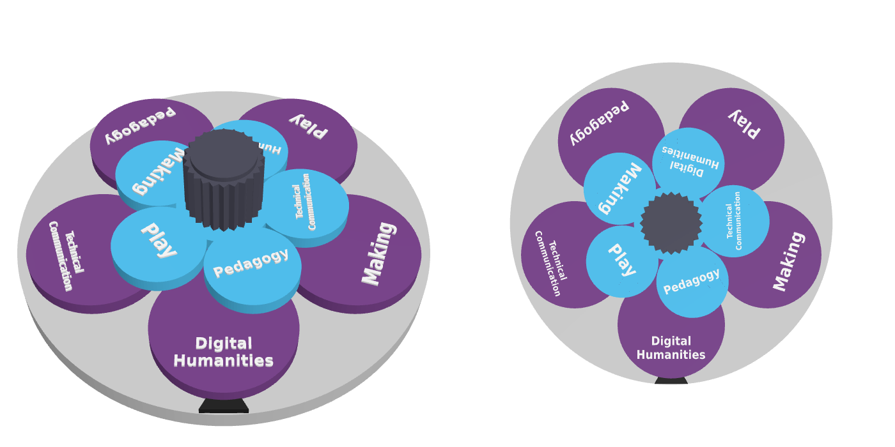

# Sandbox Site
### [Emily K. Johnson](https://cah.ucf.edu/person/emily-johnson/)

## Table of Contents
- [Cryptex](#cryptex)
- [Flower Spinner](#flower-spinner)
- [GitHub Sandbox](#github-sandbox)

## Cryptex

<figure>
  
  <figcaption>Cryptex Print</figcaption>
</figure>

A p5.js sketch from OpenProcessing, turned into a 3D printed object to hold and turn. The 3D geometry was generated by Claude, and it was printed on a Bambu Lab A1 in PLA.

**Starting point:** "Traceretry," a [Tracery-style grammar sketch](https://openprocessing.org/sketch/2609506) that generates Spanish nonsense sentences on each click. The concept was to take the sketch's generative grammar off the screen: each spinning ring holds one slot of the sentence, so turning the rings runs the grammar by hand.

**Source models:** [Number Safe – Cryptex](https://makerworld.com/en/models/882024) by finniminni (CC BY-NC) supplied the original size, ring shape, and base footprint. [Cryptex Zelda Symbol](https://makerworld.com/en/models/970985) by L.TS (CC BY-NC-SA) is a remix of that design that was downloaded and measured as a starting point.

**What changed:** the symbol rings were replaced with four word rings, ten faces each, with words recessed 1 mm into each face. The grammar was rewritten at a beginner level — every combination is grammatical, with all subjects third person singular and no gender agreement needed on rings 2–4:

| Ring 1: subject | Ring 2: when / how often | Ring 3: verb | Ring 4: how / where |
|---|---|---|---|
| el gato *(the cat)* | siempre *(always)* | come *(eats)* | mucho *(a lot)* |
| el sol *(the sun)* | nunca *(never)* | baila *(dances)* | poco *(a little)* |
| el pollo *(the chicken)* | no *(does not)* | canta *(sings)* | bien *(well)* |
| el perro *(the dog)* | también *(also)* | duerme *(sleeps)* | mal *(badly)* |
| la luna *(the moon)* | ya *(already)* | salta *(jumps)* | aquí *(here)* |
| la vaca *(the cow)* | hoy *(today)* | corre *(runs)* | allí *(there)* |
| la rana *(the frog)* | ahora *(now)* | lee *(reads)* | arriba *(up / above)* |
| la casa *(the house)* | luego *(later)* | nada *(swims)* | abajo *(down / below)* |
| ella *(she)* | pronto *(soon)* | vuela *(flies)* | lejos *(far away)* |
| él *(he)* | casi *(almost)* | bebe *(drinks)* | cerca *(nearby)* |

The result is 10,000 possible sentences, such as *La vaca siempre vuela arriba* (The cow always flies up). The lock rings and inner bolt were removed in favor of spinning-only rings on a solid spindle, and after a first cap fell off, a screw-on thread was added. An OpenSCAD version of the rings accepts any 40 words, so anyone can generate their own printed set.

**Download:** [Spanish_Word_Cryptex_All.zip](cryptex-flower/Spanish_Word_Cryptex_All.zip) — STL files for any printer, Bambu Studio plates, the OpenSCAD source, a preview of all 40 faces, and a README (CC BY-NC-SA 4.0, crediting both designers above).

<figure>
  
  <figcaption>3D preview of the cryptex casing base and its end cap.</figcaption>
</figure>

<figure>
  
  <figcaption>Cross-section profile of the screw-on cap thread, added after the first plain cap fell off.</figcaption>
</figure>

## Flower Spinner

A p5.js sketch from OpenProcessing, turned into a 3D printed object to hold and turn. The 3D geometry was generated by Claude, and it was printed on a Bambu Lab A1 in PLA.

**Starting point:** "Research Connections," a [sketch of six overlapping circles](https://openprocessing.org/sketch/2592306) (Digital Humanities, Technology, Making, Play, Pedagogy, Technical Communication) that link to research projects when clicked. The concept was a mash-up object that brings two circles together at random, so each turn suggests a new interdisciplinary project.

**Source models:** an original design, not a remix. Two existing spinners — [Print in Place Planetary Gear Spinner](https://makerworld.com/en/models/58892-print-in-place-planetary-gear-spinner) and [Spinning Flower Fidget](https://makerworld.com/en/models/1813715-spinning-flower-fidget) — were reviewed for ideas but not remixed, since their petals are fixed in place and their licenses do not allow remixes.

**What changed:** an outer ring and an inner ring of circular petals turn independently on one spindle, and the two petals that stop at the pointer form the pair. To fit in a carry-on, the rings stay stacked (inner petals partly covering the outer ones) instead of spreading out — the finished flower is about 4.6 inches (116 mm) across, with 1.5-inch outer petals and 1-inch inner petals. All six topics appear on both rings, with words recessed into each petal so it prints in one color. A ridged knob on top drags both rings by friction; because the outer ring is heavier, it lags behind the lighter inner ring, so the two rings land in different places. Four press-fit feet keep the flower level.

**Parts:** petals in rainbow PLA (outer ring, inner ring); base in galaxy PLA (base, knob and spindle, nut, four feet).

<figure>
  
  <figcaption>Early concept: top view of the paired circles under the pointer, and an exploded view of how the cap, inner ring, outer ring, and base stack on the spindle.</figcaption>
</figure>

<figure>
  
  <figcaption>An early layout option using oval petals, later dropped in favor of round ones.</figcaption>
</figure>

<figure>
  
  <figcaption>Design option D: a hexagonal spinning drum with one topic per face, considered as an alternative to circular petals but not used.</figcaption>
</figure>

<figure>
  
  <figcaption>Design option C, labeled with the outer (1.5 in) and inner (1 in) petal sizes — the layout that was ultimately used.</figcaption>
</figure>

<figure>
  
  <figcaption>The same option C layout shown blank, with the plain center cap where the knob and spindle attach.</figcaption>
</figure>

<figure>
  
  <figcaption>A 3D render of an early "sticker" version, with blank petals meant for stick-on labels and a ridged center knob.</figcaption>
</figure>

<figure>
  
  <figcaption>A 3D render of an earlier five-petal version with topic words molded directly into the petals.</figcaption>
</figure>

<figure>
  
  <figcaption>The final six-petal flower, with recessed topic words and the two-ring layout used for the printed version.</figcaption>
</figure>

## [GitHub Sandbox](sim.html)
This interactive simulation was created to give students in DIG 3171 (Tools for the Digital Humanities) and ENC 3241 (Writing for the Techincal Professional) a failure-free introduction to GitHub Sites. Inspired by a colleague’s GitHub simulation created to teach graduate students how to use the desktop version of GitHub, which I have described elsewhere as an example of future-facing interactive technical communication [[7](https://doi.org/10.1177/00472816251371625)], I used the free version of Claude (Sonnet 4.5) and my university’s enterprise version of CoPilot to create a step-by-step simulation of the GitHub web interface to walk students though each step of forking (copying) my template portfolio, customizing their new home pages, and enabling the Pages feature to publish their website([DIG 3171](https://ekjphd.github.io/DIG3171/); [ENG 3241](https://ekjphd.github.io/ENC3241/)). 

This took many iterations and re-prompting to fine-tune, and though it still is not perfect, it is enough to familiarize students with where things are in the GitHub interface. AI tools like Claude and others are bridging the gap between technical skills and educators of all disciplines, allowing those with even very little coding knowledge to create interactive digital experiences that provide innovative ways for students to engage with course content.
